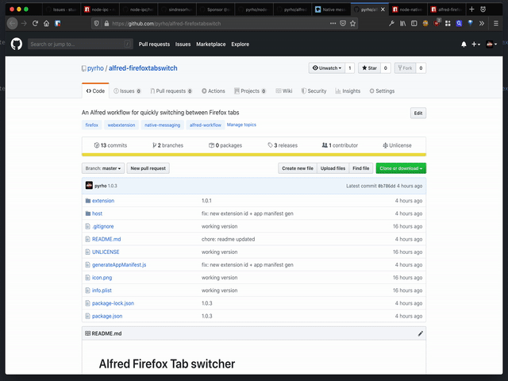

Alfred Firefox Tab switcher
===========================



An [Alfred](https://www.alfredapp.com/) workflow to quickly switch between
firefox tabs.

# Installation

## Requirements

- [nodeJS](https://nodejs.org/en/) (tested with version 13.7)
- [Node Package Manager (npm)](https://www.npmjs.com/) (usually installed alongside
    nodeJS)
- [Alfred](https://www.alfredapp.com/) + Powerpack License

## Install the Firefox extension

Go to https://addons.mozilla.org/en-US/firefox/addon/alfred-tab-switch/ and
install it from there.

## Install the workflow

```
npm install -g alfred-firefoxtabswitch
```

The workflow will register automatically with Alfred, and the
[Native Manifest](https://developer.mozilla.org/en-US/docs/Mozilla/Add-ons/WebExtensions/Native_manifests)
will be written automatically upon install at `/Library/Application Support/Mozilla/NativeMessagingHosts/alfredtabswitch.json`

# Usage

Invoke the workflow with `fw` (you can customize that in Alfred), all opened
tabs (across all windows) will be shown.

If more than one argument is supplied to the workflow, all arguments must be
present in either the title or the URL.

Then simply hit ENTER on the tab you want to focus.


# Architecture

```
                                                    ┌───────────┐
                                                    │  Alfred   │
                                                    └───────────┘
                                                          ▲
                        ╭──────────────╮                  │
                        │ ◎ ○ ○ ░░░░░░░│                  │
                        ├──────────────┤            ┌─────┴─────┐
                        │              │            │UDP socket │
                        │              │            └─────┬─────┘
                        │              │                  │
                        │       ┌──────┴─────┐            ▼
                        └───────┤ Extension  ├───────────────────────────┐
                                └──────────┬─┘  Native Messaging Host    │
                                           └─────────────────────────────┘
```

The firefox extension will automatically spawn the native messaging host at
startup.

The host will open an UDP socket on port `52547` and listen for incoming
connections.

Alfred interacts with Firefox via the UDP socket, querying for the list of tabs,
and commanding to switch to a given tab. These inteactions are handled by the
`./host/client.js` file (spawned by alfred).

Each time the user issues a command, Alfred will spawn an instance of
`host/client.js`, which will talk to the UDP socket and kill itself when the
result is returned.

If the native messaging host fails to reply within 1 second, the client will
kill itself.


## Why so complex?

[Other workflows](https://github.com/stuartcryan/rapid-browser-tabs-for-alfred)
use Apple Script to switch tabs for Safari, Chrome etc.

But Firefox does not expose its tabs to the system, so the only way is to use an
extension with an native messaging component that allows alfred to communicate
with firefox.


# Debugging

TODO
